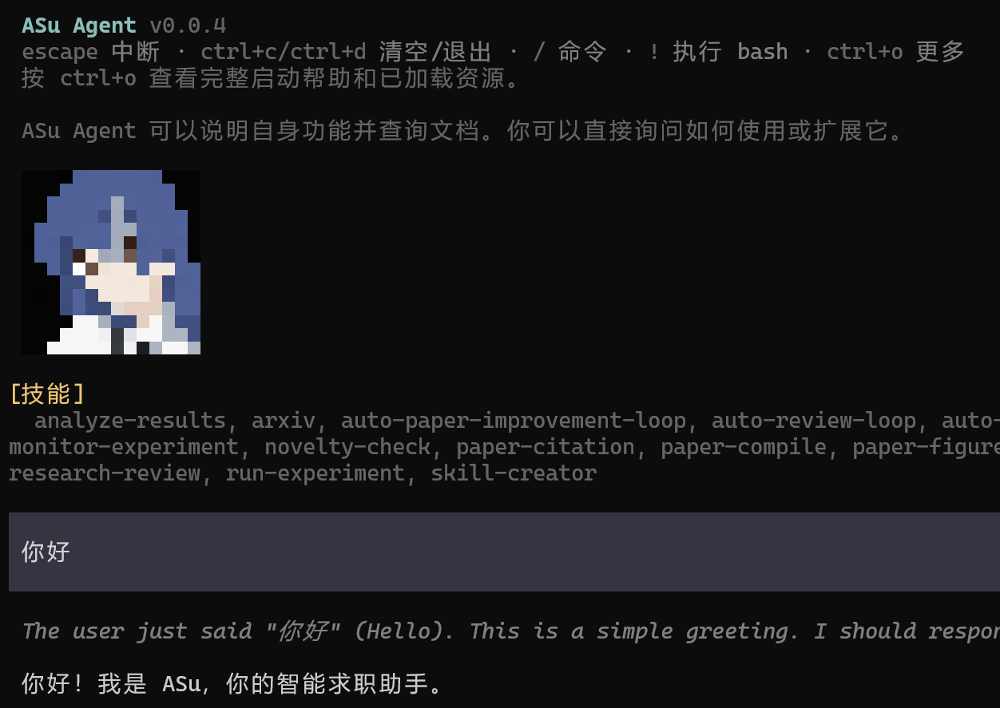

<p align="center">
  
</p>

<p align="center">
  <a href="https://www.npmjs.com/package/@hisn00w/asu-agent">
    
  </a>
  
  <a href="https://github.com/Hisn00w/Asu/stargazers">
    
  </a>
</p>

# ASu--「酥化」

ASu Agent 是面向中文求职场景的智能工作助手，聚焦简历优化、经历「酥化」、求职进度管理与面试准备。本项目基于可自扩展的 agent 框架构建。

## 预览



📋 [更新日志](packages/coding-agent/CHANGELOG.md)

## npm 安装

发布到 npm 后，普通用户全局安装：

```bash
npm install -g @hisn00w/asu-agent
```

全局卸载：

```bash
npm uninstall -g @hisn00w/asu-agent
```

安装完成后直接在终端输入：

```bash
asu
```

首次启动后请输入 `/login` 配置模型提供商，再使用 `/asu`、`/resume` 或 `/offer`。发布包会包含已构建的运行文件和模型目录数据，不需要用户克隆源码、执行构建或手动生成模型数据。

## 项目定位

ASu Agent 不是简单的简历润色器，而是把候选人的真实经历重新组织成招聘方能快速理解、可以继续追问、也能由证据支撑的求职材料。

核心表达链路是：

```text
背景目标 → 个人边界 → 关键动作 → 系统能力 → 业务价值 → 结果证据
```

项目会优先回答以下问题：

- 你是谁，目标岗位和技术方向是什么；
- 你实际负责了哪一段，而不是团队整体做了什么；
- 你解决了什么难点，采用了什么架构、流程或工具；
- 结果如何，哪些数字或公开材料可以证明；
- HR 可能继续追问什么，哪些内容还需要补证据。

## 内置求职技能

项目内置技能位于 `.asu/skills/`，克隆后即可随项目一起使用：

| 调用方式    | 用途                                            |
| ----------- | ----------------------------------------------- |
| `/asu`    | 经历酥化、岗位定位、技术简历要点和 HR 开场白    |
| `/resume` | 制作、编辑、复刻中文简历，并生成可编辑文件      |
| `/offer`  | 记录秋招投递、测评、面试、Offer、拒信和招聘进度 |

如果当前运行环境不支持真正的斜杠命令，也可以直接告诉 ASu Agent：

```text
我要酥化：请根据我的真实经历，生成目标岗位定位、简历项目亮点和 HR 开场白。
帮我制作简历：请把下面的经历整理成一份可编辑的中文技术简历。
帮我记录秋招：请更新公司、岗位、投递时间、当前状态和下一步跟进时间。
```

## 简历输出标准

ASu Agent 默认参考高密度技术简历的组织方式，但不会照抄任何人的经历或数据。

### 顶部定位

优先呈现：

- 岗位身份、目标岗位和领域方向；
- 核心技术能力和代表性项目；
- 学校、学历、毕业时间、城市和到岗信息（仅在用户提供时）；
- GitHub、论文、开源项目、竞赛或实习产出等可信背书。

### 经历与项目

每个重要项目尽量包含：

```text
项目/公司｜时间｜岗位或角色
背景：解决什么问题，服务什么业务或团队。
职责：我负责哪一段，决策权和交付边界是什么。
动作：采用什么架构、流程、工具或方法，如何解决关键难点。
结果：真实数字或可核验的定性结果。
证据：仓库、文档、上线记录、评测、论文、截图或可公开链接。
```

只有用户确实承担过相应职责时，才使用 Owner、项目负责人、核心作者、0-1、架构升级等强标签；没有可靠数字时使用“待补证据”，不编造百分比、用户量、延迟、排名或 Star 数。

### HR 开场白

短版通常控制在 80—160 字，完整版本控制在 180—280 字，结构为：

```text
身份与目标方向 → 1—2 个最强真实证据 → 期望岗位/城市/到岗时间 → 邀请继续交流
```

开头直接说明候选人身份和方向，不使用“您好，我想找一份实习”作为唯一信息；中间不复制整份简历；结尾保持自信、克制，并确保每句话都能经受 HR 追问。

## 开发指南

### 开发环境

要求 Node.js `>=22.19.0`。建议使用 Node 22 的最新维护版本；低于该版本时，模型数据生成脚本可能无法直接运行。

克隆仓库后，在项目根目录安装工作区依赖：

```bash
npm install --ignore-scripts
```

首次开发或模型目录缺失时，生成本地模型数据：

```bash
npm run hydrate:model-data
```

### 本地运行

无需先构建即可使用源码启动脚本进行调试：

```bash
./asu-test.sh
```

Windows 用户运行：

```powershell
.\asu-test.ps1
```

首次启动后输入 `/login`，选择账号登录或填写模型提供商的 API Key。

### 构建与验证

完整构建所有工作区包：

```bash
npm run build
```

构建完成后，可以直接运行产物：

```bash
node packages/coding-agent/dist/cli.js --help
node packages/coding-agent/dist/cli.js
```

提交前执行项目检查：

```bash
npm run check
```

如果只修改了模型目录数据，可先单独校验：

```bash
npm run check:model-data
```

发布 npm 包前，应先完成构建、生成发布依赖锁文件并检查 tarball 内容：

```bash
npm run build
npm run shrinkwrap:coding-agent
npm run install-lock:coding-agent
npm pack --dry-run --workspace=@hisn00w/asu-agent
```

完整协作规范见 [AGENTS.md](AGENTS.md)，贡献流程见 [CONTRIBUTING.md](CONTRIBUTING.md)。非 e2e 测试可使用 `./test.sh` 运行。

## 配置与目录

ASu Agent 的用户级配置目录默认为：

```text
~/.asu/agent/
```

项目级资源目录为：

```text
.asu/
```

其中 `.asu/skills/` 用于项目内置技能，`.asu/extensions/` 用于项目扩展，`.asu/prompts/` 用于提示词模板。内部 `@earendil-works/pi-*` 包名和部分协议字段仍保留上游名称，以保证依赖解析和 API 兼容；用户可见的 CLI 名称、配置目录、默认身份和求职提示词已改为 ASu Agent。

## 安全边界

ASu Agent 默认继承启动它的用户和进程权限，没有内置权限系统限制文件系统、进程、网络或凭据访问。需要更强隔离时，请参考上游提供的 [容器化文档](packages/coding-agent/docs/containerization.md)，选择 Gondolin、Docker 或 OpenShell 等方案。

## 分享你的Asu会话

如果你在开源工作中使用 ASu Agent ，欢迎把你的会话片段发布到 **小红书**，并带上话题 `#ASuAgent` `#开源agent #Asu`。公开的真实任务、工具使用、失败与修复案例，能帮助社区持续改进 Agent 能力。

## 致谢

本项目基于 [earendil-works/pi](https://github.com/earendil-works/pi) 开发。感谢上游项目提供可扩展的 coding-agent、TUI、会话管理、工具调用和技能加载能力。

## 许可证

本项目使用 MIT License。具体条款见 [LICENSE](LICENSE)。
